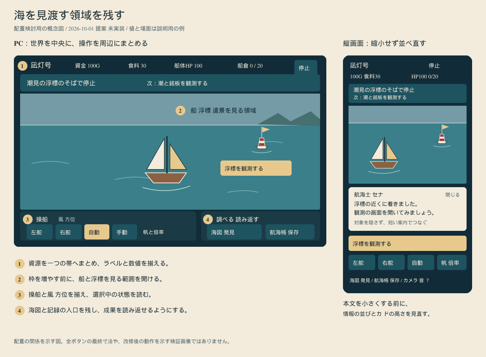
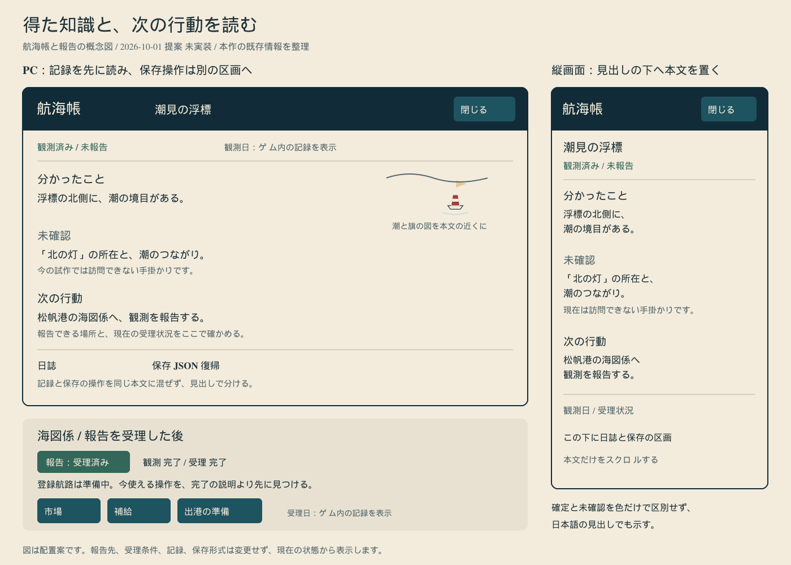

# 黒潮の航海 デザイン調査と改修用資料

調査日：2026年10月1日（日本時間）。
対象：ゲーム版「黒潮の航海 失われた潮路」v0.1.3。
状態：調査D0・基礎改修D1完了。次はD2（海上HUD）。D3〜D4は未実装。

海を広く見せ、観測で得た知識を読みやすい航海手帳に残す構成を推奨する。
船長が航海中に見るもの、港で取引するもの、調査後に読むものを、それぞれ違う明るさと密度で設計する。
現在の青緑の海と金色のアクセントを生かし、枠の装飾よりも船、浮標、次の操作、記録の内容が先に目に入る画面へ整える。

## 読む順序

| 資料 | 用途 |
| --- | --- |
| [調査報告](research_2026-10-01.md) | 9作品の評価根拠、実際に見た画面、現行画面との比較、採用理由 |
| [画面改修の引き継ぎ](handoff.md) | 画面ごとの配置、維持する操作、文字と配色、改修順、受入条件 |
| [参照元の台帳](sources.md) | 受賞主催者、開発者資料、批評、確認日、根拠の限界 |
| [参考画像の台帳](reference-media.md) | 確認した画像へのリンク、画面の種類、観察内容 |
| [参考画像の機械可読台帳](reference-media.json) | 同じ画像を再確認するためのURL、寸法、ハッシュ、出典 |
| [デザイントークン](design-tokens.json) | 色、書体、寸法、余白、動きの実装基準 |
| [D1タイポグラフィ決定](typography-d1.md) | LINE Seed JPとKlee Oneの役割、フォールバック、参照元 |
| [実装記録](implementation.md) | D1〜D4の段階、変更範囲、検証状況 |
| [水面レンダリング比較](water-renderer-comparison_2026-10-01.md) | Clearwater、CAUSTIC//VOLUME、ClearWater6.1と現行実装の比較、採用方針 |
| [資料の確認記録](verification.md) | リンクと図の確認、配色計算、ゲームと仕様書の保持 |

過去の [遊びの設計に関する8作品の調査](../exploration-research_2026-09-30.md) とは目的を分ける。
今回は、機能を増やさずに見た目と情報の読み取りを改善するための調査である。

## 配置検討用の図

以下は本作向けに作った概念図で、完成画面のスクリーンショットではない。
図中の状態と文言は説明用であり、実際のゲーム状態から更新する必要がある。

[航海画面のSVG](figures/sea-layout.svg)

[航海帳のSVG](figures/observation-book.svg)

## 参照する作品

| 主に参照する点 | 作品 |
| --- | --- |
| 船と遠景、操作画面の密度、タッチ向け再配置 | DREDGE |
| 短い説明と操作対象の接続、文章の読みやすさ | DAVE THE DIVER |
| 海、船、空、港の光の関係 | Sea of Thieves |
| 記録を読む行為の手応え、既知と未確認の区別 | Return of the Obra Dinn |
| 遠景の目標と余白 | Journey |
| 海中の奥行きと注目点の絞り方 | ABZÛ |
| 港や人物の温かさ、作業画面と背景の分離 | Spiritfarer |
| 知識を次の行動へ結び付ける記録 | Outer Wilds |
| 手帳から対象へつなぐ案内、選択と完了の区別 | ゼルダの伝説 ブレス オブ ザ ワイルド |

受賞部門、候補選出、批評上の評価は区別して記録する。
Game Designの受賞だけを、画面の美しさやUIの使いやすさの証明とは扱わない。
JourneyやABZÛを、港で交易するオープンワールドゲームと同じジャンルだとは扱わない。

## この更新の範囲

デザイン改修ではゲームのルール、保存形式、経済、操作結果、チュートリアルの進行を変更しない。D1ではゲーム版HTMLのCSSとWebフォント読込を変更する。
自由航海版とゲーム版の二版構成を保ち、仕様書版1.2のMarkdownとWordも保持する。
M4a-2は完了済み、M4a-3の航路登録と移動短縮は未着手のままである。
本資料を保存したことを、M4a全体やデザイン改修の完了には数えない。

第三者のゲーム画像はリンクと分析だけを保存し、画像ファイルをリポジトリやゲームへ取り込まない。
掲載する画像ファイルは、本作の確認画面と本作向けの新規配置図である。
参照先の画像や記事が将来変更される場合に備え、画像台帳には確認時の情報を残す。

