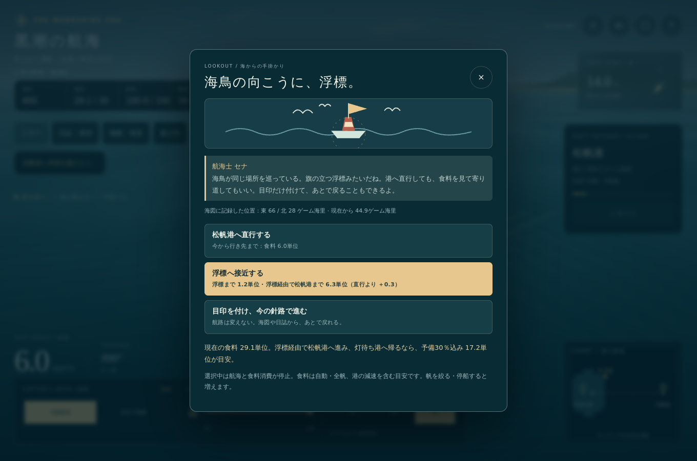
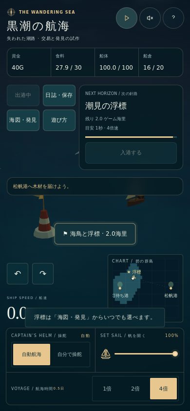
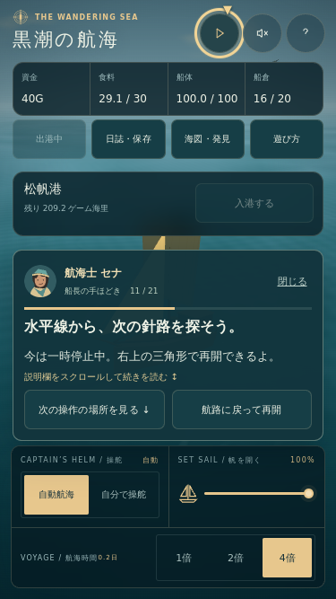
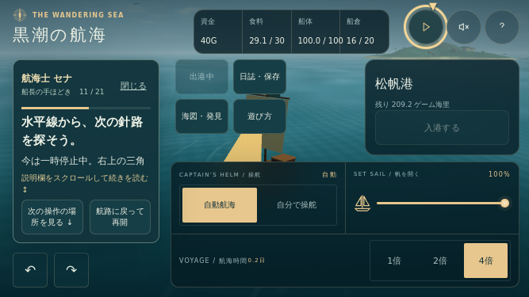

# M4a-1 視認と寄り道の検証記録

確認日：2026年10月1日（日本時間）  
対象：ゲーム版 v0.1.2、[コミット 9e5a4dc](https://github.com/ryotamatsuki/pirate-voyage/commit/9e5a4dc5e8e88cf5d672afb9b4936819adadeb51)  
工程：[Issue #2](https://github.com/ryotamatsuki/pirate-voyage/issues/2)  
実行：[Adventure checks](https://github.com/ryotamatsuki/pirate-voyage/actions/runs/36776148651)

## 確認した範囲

浮標への視認と接近、部分的な未知の海図、直行・寄り道・目印、元の航路へ復帰、選択前の食料比較、保存と再開を確認した。
観測・報告・航路登録・移動短縮は後続のM4a-2とM4a-3に残す。
初見の三問、実機Safari、FPS測定は未実施。

## ゲーム処理

`node --test tests/*.test.cjs` の33項目が成功した。
従来の取引・航海・保存14項目、初回ガイド8項目、探索11項目を含む。

探索では、位置による一度だけの視認、移動した海図セルの開示、目印による資源と航路の無変更、視認と接近の区別、寄り道と復帰、通常配送の継続、後からの接近、食料見積りと実消費、救助、旧記録と不正な拡張データを確認した。
見積りには入港前の減速を含め、帰還の予備30％を別に表示する。
視認・目印・接近だけで観測や報告にせず、資金や積荷を増やさない。

## 画面と実操作

配布するHTMLをGitHub ActionsのChromiumで起動し、隔離したブラウザ保存を使って確認した。
開発用の別ゲーム実装や利用者のセーブは使用していない。
WebGL描画はテスト環境のソフトウェア描画を使用した。

| 条件 | 画面 | 確認 |
| --- | --- | --- |
| PC | 1360×900 | 初回ガイドから実航海・寄り道・帰港・売買・配送・補強・補給・保存・JSON・ガイド完了 |
| タッチ縦 | 390×844 | 選択、ガイド、海図、自由航海、浮標到着、回転 |
| タッチ小型縦 | 375×667 | 同上。小型横画面への回転も含む |
| タッチ横 | 844×390 | 選択、ガイド、海図、自由航海、浮標到着、回転 |
| 幅の境界 | 701×393 | 同上 |
| タッチ小型横 | 667×375 | 同上。701px未満でも横画面用の配置を使用 |

タッチ条件ではPlaywrightの`tap()`で実際のボタンを押した。
PCでは選択ボタンをEnterで決定し、矢印キーで手動操舵へ切り替えた。
ガイド内のボタンは44px以上とし、案内枠の中に完全に収まることも確認した。
タッチのエミュレーションと、iPhone実機での操作・Safariの描画は区別する。

選択・海図・浮標到着中の食料と時計の停止、接近中の再読込み、閉じてから元の航路への復帰、JSONの書き出しと読み込みを確認した。
不正な拡張版を読み込んだときは、読み込み前のゲーム状態を保持した。
旧記録では資金と船の段階を保持し、浮標を未発見から始めた。
ページ例外は0件。全結果と配置の境界は[結果JSON](m4a1/results.json)に残す。

## 表示の修正

縦画面で海図と操船パネルが重なる箇所、小型画面で舵と目標が重なる箇所を修正した。
701px未満の横画面でも横用の配置を使い、回転後に目標が画面外へ出ないようにした。
横画面でもタッチ操舵を表示し、浮標の行動ボタンと独立して押せる位置に置いた。
閉じたガイドの透明領域がメニューのタップを遮らないようにし、案内カードだけが入力を受ける。
浮標への接近時は船と浮標の間をカメラの中心にし、縦画面でも双方を収める。
対象の赤白の塔体、黄色い旗、海鳥は本作のコードで描画した。

## 画面の証拠

## 保存と既存版

保存のschema 1 / two-ports-1を維持し、任意の`exploration.version:1`と`discovery.fogChunks`へ発見・目印・接近・元の航路・開いた海図を保存する。
v0.1.0/1の資源・船・積荷・契約・ガイドの進行を保持する。
不正なID・版・海図形式を受け入れない。

自由航海版の`index.html`はGit blob `6f891695f765f358ac79e062561c08006c4703da`が基準と一致する。
今回の機能はゲーム版の`adventure/index.html`へ追加した。
仕様書版1.2のMarkdown・Wordは変更していない。

M4a全体は、M4a-2・M4a-3と初見の試遊が残るため継続中。
未実施の三問を自動テストや推測で埋めていない。

